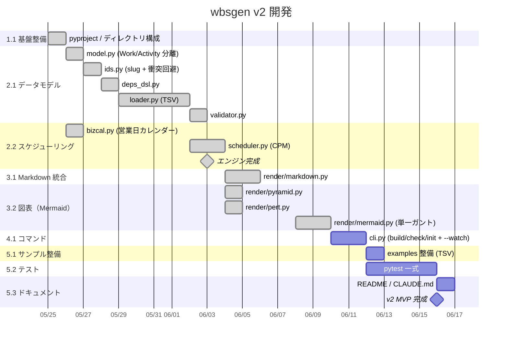

# wbsgen v2 開発 — WBS / スケジュール

本ツール wbsgen v2 (TSV ベース) の開発計画。ドッグフーディング用。

## 概要

- 期間: 2026-05-25 〜 2026-06-16（17 営業日）
- Work: 14 / Activity: 18
- クリティカルパス: 13 活動 / 17 営業日
- 進捗: ✅ 13 完了 / 🟢 1 着手中 / ⛔ 0 ブロック

## WBS（構造の俯瞰）

```mermaid
%%{init: {'flowchart': {'curve': 'stepBefore'}}}%%
flowchart TB
    __project_root__["wbsgen v2 開発"]
    w_setup["<b>1</b> セットアップ"]
    w_setup_base["<b>1.1</b> 基盤整備"]
    w_engine["<b>2</b> コアエンジン"]
    w_engine_data["<b>2.1</b> データモデル"]
    w_engine_sched["<b>2.2</b> スケジューリング"]
    w_render["<b>3</b> レンダリング"]
    w_render_md["<b>3.1</b> Markdown 統合"]
    w_render_vis["<b>3.2</b> 図表（Mermaid）"]
    w_cli["<b>4</b> CLI"]
    w_cli_cmd["<b>4.1</b> コマンド"]
    w_finish["<b>5</b> 検証と仕上げ"]
    w_finish_ex["<b>5.1</b> サンプル整備"]
    w_finish_test["<b>5.2</b> テスト"]
    w_finish_doc["<b>5.3</b> ドキュメント"]
    __project_root__ --> w_setup
    __project_root__ --> w_engine
    __project_root__ --> w_render
    __project_root__ --> w_cli
    __project_root__ --> w_finish
    w_setup --> w_setup_base
    w_engine --> w_engine_data
    w_engine --> w_engine_sched
    w_render --> w_render_md
    w_render --> w_render_vis
    w_cli --> w_cli_cmd
    w_finish --> w_finish_ex
    w_finish --> w_finish_test
    w_finish --> w_finish_doc

    classDef root fill:#1e3a8a,stroke:#0b1a3d,color:#ffffff,stroke-width:2px
    classDef work fill:#dbeafe,stroke:#1e3a8a,color:#0b1a3d
    classDef wp fill:#93c5fd,stroke:#1e3a8a,color:#0b1a3d,stroke-width:2px
    classDef l3group fill:none,stroke:#9ca3af,stroke-dasharray:3 3,color:#1f2937,text-align:left
    class __project_root__ root
    class w_setup,w_engine,w_cli,w_finish,w_render work
    class w_engine_sched,w_cli_cmd,w_finish_test,w_render_vis,w_finish_doc,w_finish_ex,w_setup_base,w_render_md,w_engine_data wp
```

## WBS 辞書

本ツール wbsgen 自身の開発 MVP を WP で分解したもの。
各 WP の意図と完了基準を以下に整理する。

## 1.1 基盤整備 (w-setup-base)

- pyproject.toml、ディレクトリ構成、Python 仮想環境
- 完了基準: `pip install -e .` が通る

## 2.1 データモデル (w-engine-data)

- Work / Activity / Dependency などの dataclass
- ID slug 生成、TSV loader、依存 DSL パーサ、validator
- 完了基準: TSV を読み込んで Project オブジェクトを構築できる

## 2.2 スケジューリング (w-engine-sched)

- 営業日カレンダー (jpholiday 連携)
- CPM 前進パス・後退パス・float 計算
- 完了基準: ES/EF/LS/LF/TF/FF/Critical が全活動について算出される

## 3.1 Markdown 統合 (w-render-md)

- render/markdown.py: 全セクションを1ファイルに統合
- 完了基準: build/wbs.md が生成され、VS Code Markdown プレビューで読める

## 3.2 図表 (w-render-vis)

- WBS pyramid (flowchart TB) / Gantt (gantt) / PERT (AOA flowchart)
- 完了基準: 3 図ともプレビューで描画される

## 4.1 コマンド (w-cli-cmd)

- `wbsgen build / check / init` + `--watch` + `--rewrite-order`
- 完了基準: 雛形展開からビルドまで CLI 1行で完結

## 5.1 サンプル整備 (w-finish-ex)

- examples 3つ (generic / dogfood / home-cooking) を整備
- 完了基準: 各 example が `wbsgen check` を通り、build できる

## 5.2 テスト (w-finish-test)

- pytest による回帰テスト
- 完了基準: 70+ テストが green

## 5.3 ドキュメント (w-finish-doc)

- README / CLAUDE.md
- 完了基準: 新規ユーザーが README を読んで自分のプロジェクトを立ち上げられる

## ガントチャート（時系列）

## PERT 図（依存ネットワーク）

_クリティカルパスは太線で表示。`==>` がクリティカル、`-->` が通常。_

```mermaid
flowchart LR
    e1(("①"))
    e2((2))
    e3((3))
    e4((4))
    e5((5))
    e6((6))
    e7((7))
    e8((8))
    e9((9))
    e10((10))
    e11((11))
    e12((12))
    e13((13))
    e14((14))
    e15((15))
    e16((16))
    e17((17))
    e18((18))
    e19((19))
    e20((20))
    e21((21))
    e22((22))
    e23(("◎"))
    e1 ==>|"1.1 pyproject / ディレクトリ構成 (1d)"| e2
    e2 -->|"2.2 bizcal.py (営業日カレンダー) (1d)"| e3
    e2 ==>|"2.1 model.py (Work/Activity 分離) (1d)"| e4
    e4 ==>|"2.1 ids.py (slug + 衝突回避) (1d)"| e5
    e5 ==>|"2.1 deps_dsl.py (1d)"| e6
    e6 ==>|"2.1 loader.py (TSV) (2d)"| e7
    e8 ==>|"2.2 scheduler.py (CPM) (2d)"| e9
    e7 -->|"2.1 validator.py (1d)"| e10
    e11 ==>|"2.2 エンジン完成 ◆"| e12
    e12 ==>|"3.1 render/markdown.py (2d)"| e13
    e12 -->|"3.2 render/pert.py (1d)"| e14
    e12 -->|"3.2 render/pyramid.py (1d)"| e15
    e13 ==>|"3.2 render/mermaid.py (単一ガント) (2d)"| e16
    e17 ==>|"4.1 cli.py (build/check/init + --watch) (2d)"| e18
    e18 -->|"5.1 examples 整備 (TSV) (1d)"| e19
    e18 ==>|"5.2 pytest 一式 (2d)"| e20
    e20 ==>|"5.3 README / CLAUDE.md (1d)"| e21
    e22 ==>|"5.3 v2 MVP 完成 ◆"| e23
    e7 -.->|dummy| e8
    e3 -.->|dummy| e8
    e10 -.->|dummy| e11
    e9 -.->|dummy| e11
    e13 -.->|dummy| e17
    e16 -.->|dummy| e17
    e15 -.->|dummy| e17
    e14 -.->|dummy| e17
    e19 -.->|dummy| e22
    e20 -.->|dummy| e22
    e21 -.->|dummy| e22

    classDef evt fill:#f8fafc,stroke:#1e293b,color:#0f172a
    classDef startend fill:#1e3a8a,stroke:#0b1a3d,color:#ffffff,stroke-width:2px
    class e1,e2,e3,e4,e5,e6,e7,e8,e9,e10,e11,e12,e13,e14,e15,e16,e17,e18,e19,e20,e21,e22,e23 evt
    class e1,e23 startend
```

## ワークパッケージ別 進捗

_WP = WBS の最下層（リーフ work）。アクティビティのステータス集計と進捗を WP 単位で表示。_

| WBS | ワークパッケージ | ✅完了 | ⏳着手中 | ⬜未着手 | ⛔ブロック | 計 | 進捗 |
| --- | --- | --- | --- | --- | --- | --- | --- |
| 1.1 | 基盤整備 | 1 | 0 | 0 | 0 | 1 | `██████████` 100% |
| 2.1 | データモデル | 5 | 0 | 0 | 0 | 5 | `██████████` 100% |
| 2.2 | スケジューリング | 3 | 0 | 0 | 0 | 3 | `██████████` 100% |
| 3.1 | Markdown 統合 | 1 | 0 | 0 | 0 | 1 | `██████████` 100% |
| 3.2 | 図表（Mermaid） | 3 | 0 | 0 | 0 | 3 | `██████████` 100% |
| 4.1 | コマンド | 0 | 1 | 0 | 0 | 1 | `░░░░░░░░░░` 0% |
| 5.1 | サンプル整備 | 0 | 0 | 1 | 0 | 1 | `░░░░░░░░░░` 0% |
| 5.2 | テスト | 0 | 0 | 1 | 0 | 1 | `░░░░░░░░░░` 0% |
| 5.3 | ドキュメント | 0 | 0 | 2 | 0 | 2 | `░░░░░░░░░░` 0% |
| **計** | **全 WP** | **13** | **1** | **4** | **0** | **18** | `███████░░░` **72%** |

## アクティビティ詳細

| WP | ID | 名称 | 状態 | 所要 | 先行 | ES | EF | TF | FF | 開始 | 終了 | CP |
| --- | --- | --- | --- | --- | --- | --- | --- | --- | --- | --- | --- | --- |
| 1.1 | `a-pyproject` | pyproject / ディレクトリ構成 | ✅ done | 1 | — | 0 | 1 | 0 | 0 | 2026-05-25 | 2026-05-25 | ★ |
| 2.2 | `a-bizcal` | bizcal.py (営業日カレンダー) | ✅ done | 1 | a-pyproject | 1 | 2 | 4 | 4 | 2026-05-26 | 2026-05-26 |  |
| 2.1 | `a-model` | model.py (Work/Activity 分離) | ✅ done | 1 | a-pyproject | 1 | 2 | 0 | 0 | 2026-05-26 | 2026-05-26 | ★ |
| 2.1 | `a-ids` | ids.py (slug + 衝突回避) | ✅ done | 1 | a-model | 2 | 3 | 0 | 0 | 2026-05-27 | 2026-05-27 | ★ |
| 2.1 | `a-deps-dsl` | deps_dsl.py | ✅ done | 1 | a-ids | 3 | 4 | 0 | 0 | 2026-05-28 | 2026-05-28 | ★ |
| 2.1 | `a-loader` | loader.py (TSV) | ✅ done | 2 | a-deps-dsl | 4 | 6 | 0 | 0 | 2026-05-29 | 2026-06-01 | ★ |
| 2.2 | `a-scheduler` | scheduler.py (CPM) | ✅ done | 2 | a-loader, a-bizcal | 6 | 8 | 0 | 0 | 2026-06-02 | 2026-06-03 | ★ |
| 2.1 | `a-validator` | validator.py | ✅ done | 1 | a-loader | 6 | 7 | 1 | 1 | 2026-06-02 | 2026-06-02 | ✦ |
| 3.1 | `a-render-md` | render/markdown.py | ✅ done | 2 | a-m-engine | 8 | 10 | 0 | 0 | 2026-06-04 | 2026-06-05 | ★ |
| 3.2 | `a-render-pyramid` | render/pyramid.py | ✅ done | 1 | a-m-engine | 8 | 9 | 3 | 3 | 2026-06-04 | 2026-06-04 |  |
| 2.2 | `a-m-engine` | エンジン完成 ◆ | ✅ done | 0 | a-validator, a-scheduler | 8 | 8 | 0 | 0 | 2026-06-03 | 2026-06-03 | ★ |
| 3.2 | `a-render-pert` | render/pert.py | ✅ done | 1 | a-m-engine | 8 | 9 | 3 | 3 | 2026-06-04 | 2026-06-04 |  |
| 3.2 | `a-render-mermaid` | render/mermaid.py (単一ガント) | ✅ done | 2 | a-render-md | 10 | 12 | 0 | 0 | 2026-06-08 | 2026-06-09 | ★ |
| 4.1 | `a-cli` | cli.py (build/check/init + --watch) | 🟢 doing | 2 | a-render-md, a-render-mermaid, a-render-pyramid, a-render-pert | 12 | 14 | 0 | 0 | 2026-06-10 | 2026-06-11 | ★ |
| 5.1 | `a-examples` | examples 整備 (TSV) | todo | 1 | a-cli | 14 | 15 | 2 | 2 | 2026-06-12 | 2026-06-12 | ✦ |
| 5.2 | `a-tests` | pytest 一式 | todo | 2 | a-cli | 14 | 16 | 0 | 0 | 2026-06-12 | 2026-06-15 | ★ |
| 5.3 | `a-docs` | README / CLAUDE.md | todo | 1 | a-tests | 16 | 17 | 0 | 0 | 2026-06-16 | 2026-06-16 | ★ |
| 5.3 | `a-m-mvp` | v2 MVP 完成 ◆ | todo | 0 | a-examples, a-tests, a-docs | 17 | 17 | 0 | 0 | 2026-06-16 | 2026-06-16 | ★ |

凡例: **CP** ★=クリティカル ✦=ニア・クリティカル / **TF**=トータルフロート **FF**=フリーフロート / **先行** 例: `a-foo+2` = FS ラグ+2 / `a-bar/SS` = SS / `a-baz/FF-1` = FF ラグ-1

## クリティカルパス

`a-pyproject` pyproject / ディレクトリ構成 → `a-model` model.py (Work/Activity 分離) → `a-ids` ids.py (slug + 衝突回避) → `a-deps-dsl` deps_dsl.py → `a-loader` loader.py (TSV) → `a-scheduler` scheduler.py (CPM) → `a-m-engine` エンジン完成 → `a-render-md` render/markdown.py → `a-render-mermaid` render/mermaid.py (単一ガント) → `a-cli` cli.py (build/check/init + --watch) → `a-tests` pytest 一式 → `a-docs` README / CLAUDE.md → `a-m-mvp` v2 MVP 完成

_合計: 17 営業日_

## ニア・クリティカル

- `a-validator` validator.py (TF=1)
- `a-examples` examples 整備 (TSV) (TF=2)
