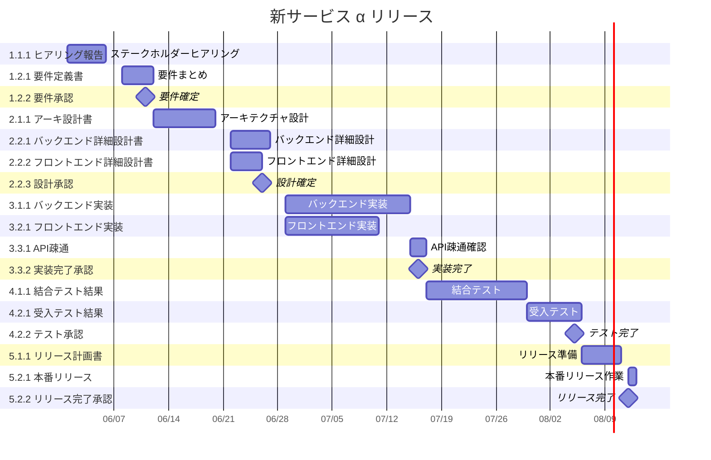

# 新サービス α リリース — WBS / スケジュール

ソフトウェア開発の典型的な計画（要件・設計・実装・テスト・リリース）

## 概要

- 期間: 2026-06-01 〜 2026-08-12（51 営業日）
- Work: 33 / Activity: 17
- クリティカルパス: 15 活動 / 51 営業日
- 進捗: ✅ 0 完了 / 🟢 0 着手中 / ⛔ 0 ブロック

## WBS（構造の俯瞰）

```mermaid
%%{init: {'flowchart': {'curve': 'stepBefore'}}}%%
flowchart TB
    __project_root__["新サービス α リリース"]
    w_req["<b>1</b> 要件定義"]
    w_req_interview["<b>1.1</b> ヒアリング"]
    w_req_org["<b>1.2</b> 要件整理"]
    w_design["<b>2</b> 設計"]
    w_design_arch["<b>2.1</b> アーキ設計"]
    w_design_detail["<b>2.2</b> 詳細設計"]
    w_impl["<b>3</b> 実装"]
    w_impl_be["<b>3.1</b> バックエンド"]
    w_impl_fe["<b>3.2</b> フロントエンド"]
    w_impl_integration["<b>3.3</b> 結合"]
    w_test["<b>4</b> テスト"]
    w_test_int["<b>4.1</b> 結合テスト"]
    w_test_uat["<b>4.2</b> 受入テスト"]
    w_release["<b>5</b> リリース"]
    w_release_prep["<b>5.1</b> 準備"]
    w_release_exec["<b>5.2</b> 実施"]
    w_req_interview__l3group["<b>1.1.1</b> ヒアリング報告"]
    w_req_org__l3group["<b>1.2.1</b> 要件定義書<br/><b>1.2.2</b> 要件承認"]
    w_design_arch__l3group["<b>2.1.1</b> アーキ設計書"]
    w_design_detail__l3group["<b>2.2.1</b> バックエンド詳細設計書<br/><b>2.2.2</b> フロントエンド詳細設計書<br/><b>2.2.3</b> 設計承認"]
    w_impl_be__l3group["<b>3.1.1</b> バックエンド実装"]
    w_impl_fe__l3group["<b>3.2.1</b> フロントエンド実装"]
    w_impl_integration__l3group["<b>3.3.1</b> API疎通<br/><b>3.3.2</b> 実装完了承認"]
    w_test_int__l3group["<b>4.1.1</b> 結合テスト結果"]
    w_test_uat__l3group["<b>4.2.1</b> 受入テスト結果<br/><b>4.2.2</b> テスト承認"]
    w_release_prep__l3group["<b>5.1.1</b> リリース計画書"]
    w_release_exec__l3group["<b>5.2.1</b> 本番リリース<br/><b>5.2.2</b> リリース完了承認"]
    __project_root__ --> w_req
    __project_root__ --> w_design
    __project_root__ --> w_impl
    __project_root__ --> w_test
    __project_root__ --> w_release
    w_req --> w_req_interview
    w_req --> w_req_org
    w_design --> w_design_arch
    w_design --> w_design_detail
    w_impl --> w_impl_be
    w_impl --> w_impl_fe
    w_impl --> w_impl_integration
    w_test --> w_test_int
    w_test --> w_test_uat
    w_release --> w_release_prep
    w_release --> w_release_exec
    w_req_interview --> w_req_interview__l3group
    w_req_org --> w_req_org__l3group
    w_design_arch --> w_design_arch__l3group
    w_design_detail --> w_design_detail__l3group
    w_impl_be --> w_impl_be__l3group
    w_impl_fe --> w_impl_fe__l3group
    w_impl_integration --> w_impl_integration__l3group
    w_test_int --> w_test_int__l3group
    w_test_uat --> w_test_uat__l3group
    w_release_prep --> w_release_prep__l3group
    w_release_exec --> w_release_exec__l3group

    classDef root fill:#1e3a8a,stroke:#0b1a3d,color:#ffffff,stroke-width:2px
    classDef work fill:#dbeafe,stroke:#1e3a8a,color:#0b1a3d
    classDef wp fill:#93c5fd,stroke:#1e3a8a,color:#0b1a3d,stroke-width:2px
    classDef l3group fill:none,stroke:#9ca3af,stroke-dasharray:3 3,color:#1f2937,text-align:left
    class __project_root__ root
    class w_design,w_impl,w_impl_fe,w_test,w_release_exec,w_test_int,w_release_prep,w_req,w_req_interview,w_req_org,w_test_uat,w_design_arch,w_impl_be,w_impl_integration,w_design_detail,w_release work
    class w_req_interview__l3group,w_req_org__l3group,w_design_arch__l3group,w_design_detail__l3group,w_impl_be__l3group,w_impl_fe__l3group,w_impl_integration__l3group,w_test_int__l3group,w_test_uat__l3group,w_release_prep__l3group,w_release_exec__l3group l3group
```

## WBS 辞書

各 WP (ワークパッケージ) の補足説明。受入基準・前提・責任分担などを記録する。
build 時に wbs.md の「WBS 辞書」セクションとして取り込まれる。

## 1.1.1 ヒアリング報告 (w-req-interview-record)

- **受入基準**: 全ステークホルダーから要望を聞き取り、議事録を整理済み
- **責任者**: PM
- **前提**: ステークホルダーリスト確定済み

## 1.2.1 要件定義書 (w-req-org-doc)

- **受入基準**: ヒアリング報告を元に機能要件・非機能要件を文書化
- **責任者**: PM + テックリード

## 1.2.2 要件承認 (w-req-org-confirm)

- **受入基準**: ステークホルダー全員から要件定義書の承認を取得
- マイルストーン: ここ以降の設計フェーズに進むゲート

## 2.1.1 アーキ設計書 (w-design-arch-doc)

- **受入基準**: 全体アーキテクチャ図 + 主要技術選定 + 非機能観点の整理
- **責任者**: テックリード

## 2.2.1 / 2.2.2 詳細設計書 (バックエンド / フロントエンド)

- **受入基準**: コンポーネント設計、データモデル、API I/F の明示
- **責任分担**: 2.2.1 BE 担当 / 2.2.2 FE 担当

## 2.2.3 設計承認 (w-design-detail-confirm)

- マイルストーン: 実装着手のゲート

## 3.3.1 API 疎通 (w-impl-integration-api)

- **受入基準**: 主要 API が BE-FE 間で疎通確認できている
- **前提**: BE 実装と FE 実装の両方が完了

## 3.3.2 / 4.2.2 / 5.2.2 各承認マイルストーン

- いずれもフェーズ終了のチェックポイント

## ガントチャート（時系列）

## PERT 図（依存ネットワーク）

_クリティカルパスは太線で表示。`==>` がクリティカル、`-->` が通常。_

```mermaid
flowchart LR
    e1(("①"))
    e2((2))
    e3((3))
    e4((4))
    e5((5))
    e6((6))
    e7((7))
    e8((8))
    e9((9))
    e10((10))
    e11((11))
    e12((12))
    e13((13))
    e14((14))
    e15((15))
    e16((16))
    e17((17))
    e18((18))
    e19((19))
    e20(("◎"))
    e1 ==>|"1.1.1 ステークホルダーヒアリング (5d)"| e2
    e2 ==>|"1.2.1 要件まとめ (4d)"| e3
    e3 ==>|"1.2.2 要件確定 ◆"| e4
    e4 ==>|"2.1.1 アーキテクチャ設計 (6d)"| e5
    e5 ==>|"2.2.1 バックエンド詳細設計 (5d)"| e6
    e5 -->|"2.2.2 フロントエンド詳細設計 (4d)"| e7
    e8 ==>|"2.2.3 設計確定 ◆"| e9
    e9 ==>|"3.1.1 バックエンド実装 (12d)"| e10
    e9 -->|"3.2.1 フロントエンド実装 (10d)"| e11
    e12 ==>|"3.3.1 API疎通確認 (2d)"| e13
    e13 ==>|"3.3.2 実装完了 ◆"| e14
    e14 ==>|"4.1.1 結合テスト (8d)"| e15
    e15 ==>|"4.2.1 受入テスト (5d)"| e16
    e16 ==>|"4.2.2 テスト完了 ◆"| e17
    e17 ==>|"5.1.1 リリース準備 (3d)"| e18
    e18 ==>|"5.2.1 本番リリース作業 (1d)"| e19
    e19 ==>|"5.2.2 リリース完了 ◆"| e20
    e6 -.->|dummy| e8
    e7 -.->|dummy| e8
    e10 -.->|dummy| e12
    e11 -.->|dummy| e12

    classDef evt fill:#f8fafc,stroke:#1e293b,color:#0f172a
    classDef startend fill:#1e3a8a,stroke:#0b1a3d,color:#ffffff,stroke-width:2px
    class e1,e2,e3,e4,e5,e6,e7,e8,e9,e10,e11,e12,e13,e14,e15,e16,e17,e18,e19,e20 evt
    class e1,e20 startend
```

## ワークパッケージ別 進捗

_WP = WBS の最下層（リーフ work）。アクティビティのステータス集計と進捗を WP 単位で表示。_

| WBS | ワークパッケージ | ✅完了 | ⏳着手中 | ⬜未着手 | ⛔ブロック | 計 | 進捗 |
| --- | --- | --- | --- | --- | --- | --- | --- |
| 1.1.1 | ヒアリング報告 | 0 | 0 | 1 | 0 | 1 | `░░░░░░░░░░` 0% |
| 1.2.1 | 要件定義書 | 0 | 0 | 1 | 0 | 1 | `░░░░░░░░░░` 0% |
| 1.2.2 | 要件承認 | 0 | 0 | 1 | 0 | 1 | `░░░░░░░░░░` 0% |
| 2.1.1 | アーキ設計書 | 0 | 0 | 1 | 0 | 1 | `░░░░░░░░░░` 0% |
| 2.2.1 | バックエンド詳細設計書 | 0 | 0 | 1 | 0 | 1 | `░░░░░░░░░░` 0% |
| 2.2.2 | フロントエンド詳細設計書 | 0 | 0 | 1 | 0 | 1 | `░░░░░░░░░░` 0% |
| 2.2.3 | 設計承認 | 0 | 0 | 1 | 0 | 1 | `░░░░░░░░░░` 0% |
| 3.1.1 | バックエンド実装 | 0 | 0 | 1 | 0 | 1 | `░░░░░░░░░░` 0% |
| 3.2.1 | フロントエンド実装 | 0 | 0 | 1 | 0 | 1 | `░░░░░░░░░░` 0% |
| 3.3.1 | API疎通 | 0 | 0 | 1 | 0 | 1 | `░░░░░░░░░░` 0% |
| 3.3.2 | 実装完了承認 | 0 | 0 | 1 | 0 | 1 | `░░░░░░░░░░` 0% |
| 4.1.1 | 結合テスト結果 | 0 | 0 | 1 | 0 | 1 | `░░░░░░░░░░` 0% |
| 4.2.1 | 受入テスト結果 | 0 | 0 | 1 | 0 | 1 | `░░░░░░░░░░` 0% |
| 4.2.2 | テスト承認 | 0 | 0 | 1 | 0 | 1 | `░░░░░░░░░░` 0% |
| 5.1.1 | リリース計画書 | 0 | 0 | 1 | 0 | 1 | `░░░░░░░░░░` 0% |
| 5.2.1 | 本番リリース | 0 | 0 | 1 | 0 | 1 | `░░░░░░░░░░` 0% |
| 5.2.2 | リリース完了承認 | 0 | 0 | 1 | 0 | 1 | `░░░░░░░░░░` 0% |
| **計** | **全 WP** | **0** | **0** | **17** | **0** | **17** | `░░░░░░░░░░` **0%** |

## アクティビティ詳細

| WP | ID | 名称 | 状態 | 所要 | 先行 | ES | EF | TF | FF | 開始 | 終了 | CP |
| --- | --- | --- | --- | --- | --- | --- | --- | --- | --- | --- | --- | --- |
| 1.1.1 | `a-stakeholder-interview` | ステークホルダーヒアリング | todo | 5 | — | 0 | 5 | 0 | 0 | 2026-06-01 | 2026-06-05 | ★ |
| 1.2.1 | `a-req-summary` | 要件まとめ | todo | 4 | a-stakeholder-interview | 5 | 9 | 0 | 0 | 2026-06-08 | 2026-06-11 | ★ |
| 2.1.1 | `a-arch-design` | アーキテクチャ設計 | todo | 6 | a-m-req-complete | 9 | 15 | 0 | 0 | 2026-06-12 | 2026-06-19 | ★ |
| 1.2.2 | `a-m-req-complete` | 要件確定 ◆ | todo | 0 | a-req-summary | 9 | 9 | 0 | 0 | 2026-06-11 | 2026-06-11 | ★ |
| 2.2.1 | `a-be-detail` | バックエンド詳細設計 | todo | 5 | a-arch-design | 15 | 20 | 0 | 0 | 2026-06-22 | 2026-06-26 | ★ |
| 2.2.2 | `a-fe-detail` | フロントエンド詳細設計 | todo | 4 | a-arch-design | 15 | 19 | 1 | 1 | 2026-06-22 | 2026-06-25 | ✦ |
| 3.1.1 | `a-be-impl` | バックエンド実装 | todo | 12 | a-m-design-complete | 20 | 32 | 0 | 0 | 2026-06-29 | 2026-07-14 | ★ |
| 3.2.1 | `a-fe-impl` | フロントエンド実装 | todo | 10 | a-m-design-complete | 20 | 30 | 2 | 2 | 2026-06-29 | 2026-07-10 | ✦ |
| 2.2.3 | `a-m-design-complete` | 設計確定 ◆ | todo | 0 | a-be-detail, a-fe-detail | 20 | 20 | 0 | 0 | 2026-06-26 | 2026-06-26 | ★ |
| 3.3.1 | `a-api-integration` | API疎通確認 | todo | 2 | a-be-impl, a-fe-impl | 32 | 34 | 0 | 0 | 2026-07-15 | 2026-07-16 | ★ |
| 4.1.1 | `a-int-test` | 結合テスト | todo | 8 | a-m-impl-complete | 34 | 42 | 0 | 0 | 2026-07-17 | 2026-07-29 | ★ |
| 3.3.2 | `a-m-impl-complete` | 実装完了 ◆ | todo | 0 | a-api-integration | 34 | 34 | 0 | 0 | 2026-07-16 | 2026-07-16 | ★ |
| 4.2.1 | `a-uat` | 受入テスト | todo | 5 | a-int-test | 42 | 47 | 0 | 0 | 2026-07-30 | 2026-08-05 | ★ |
| 4.2.2 | `a-m-test-complete` | テスト完了 ◆ | todo | 0 | a-uat | 47 | 47 | 0 | 0 | 2026-08-05 | 2026-08-05 | ★ |
| 5.1.1 | `a-release-prep` | リリース準備 | todo | 3 | a-m-test-complete | 47 | 50 | 0 | 0 | 2026-08-06 | 2026-08-10 | ★ |
| 5.2.1 | `a-release` | 本番リリース作業 | todo | 1 | a-release-prep | 50 | 51 | 0 | 0 | 2026-08-12 | 2026-08-12 | ★ |
| 5.2.2 | `a-m-release-complete` | リリース完了 ◆ | todo | 0 | a-release | 51 | 51 | 0 | 0 | 2026-08-12 | 2026-08-12 | ★ |

凡例: **CP** ★=クリティカル ✦=ニア・クリティカル / **TF**=トータルフロート **FF**=フリーフロート / **先行** 例: `a-foo+2` = FS ラグ+2 / `a-bar/SS` = SS / `a-baz/FF-1` = FF ラグ-1

## クリティカルパス

`a-stakeholder-interview` ステークホルダーヒアリング → `a-req-summary` 要件まとめ → `a-m-req-complete` 要件確定 → `a-arch-design` アーキテクチャ設計 → `a-be-detail` バックエンド詳細設計 → `a-m-design-complete` 設計確定 → `a-be-impl` バックエンド実装 → `a-api-integration` API疎通確認 → `a-m-impl-complete` 実装完了 → `a-int-test` 結合テスト → `a-uat` 受入テスト → `a-m-test-complete` テスト完了 → `a-release-prep` リリース準備 → `a-release` 本番リリース作業 → `a-m-release-complete` リリース完了

_合計: 51 営業日_

## ニア・クリティカル

- `a-fe-detail` フロントエンド詳細設計 (TF=1)
- `a-fe-impl` フロントエンド実装 (TF=2)
