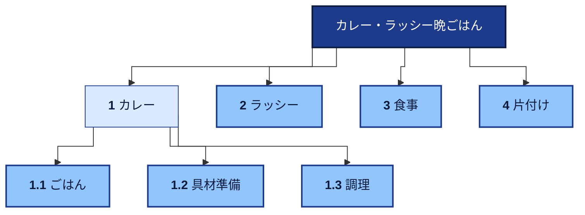
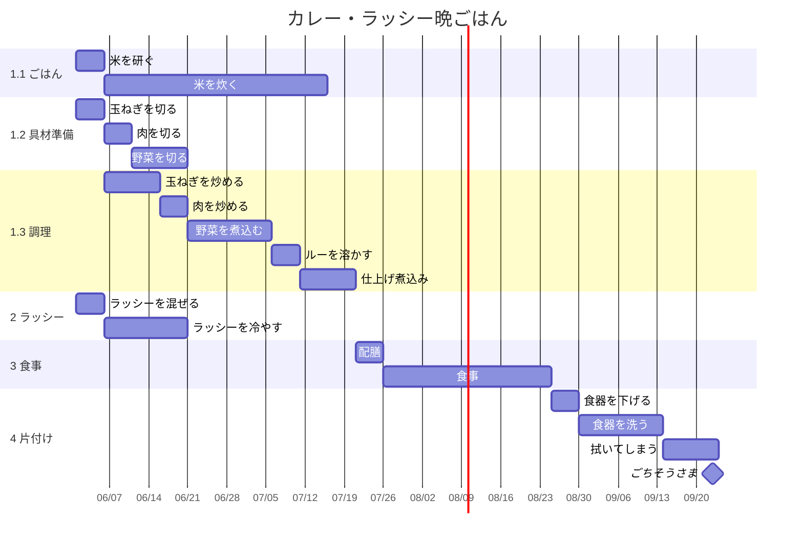

# カレー・ラッシー晩ごはん — WBS / スケジュール

依存関係の複雑な例。並行作業（米炊き／具材準備／ラッシー）が複数走り、
合流点（配膳）で揃ったあと食事 → 片付けへ進む。FS／SS の典型例。

**注**: 実際の所要は約2時間。ツールは整数 duration を「営業日」として
扱う仕様のため、ガントの日付軸は「分→日」に読み替えたものとなる。
あくまで並行関係と依存関係の見え方を確認するためのサンプル。

## 概要

- 期間: 2026-06-01 〜 2026-09-23（115 営業日）
- Work: 7 / Activity: 18
- クリティカルパス: 12 活動 / 115 営業日
- 進捗: ✅ 0 完了 / 🟢 0 着手中 / ⛔ 0 ブロック

## WBS（構造の俯瞰）

## WBS 辞書

各 WP の補足。家庭料理レベルなので軽め。

## 1.1 ごはん (w-curry-rice)

- 炊飯器に任せる時間 (40分) は他作業に充てる
- 完了基準: 米が炊きあがっている状態

## 1.2 具材準備 (w-curry-prep)

- まな板と包丁を共有するため、玉ねぎ → 肉 → 野菜 の直列
- 完了基準: 全具材が鍋投入可能な形に切られている

## 1.3 調理 (w-curry-cook)

- 炒め → 煮込み → ルー投入 → 仕上げ
- 完了基準: 仕上げ煮込みが終わり、味見 OK

## 2 ラッシー (w-lassi)

- 米炊きと並行して開始可能 (依存なしの独立起点)
- 完了基準: 冷蔵庫で十分に冷えている

## 3 食事 (w-meal)

- 配膳は米／カレー／ラッシー全て揃ってから
- 完了基準: 完食

## 4 片付け (w-cleanup)

- 直列に進む (下げる → 洗う → 拭く)
- 完了基準: 食器・調理器具が定位置に戻っている

## ガントチャート（時系列）

## PERT 図（依存ネットワーク）

_クリティカルパスは太線で表示。`==>` がクリティカル、`-->` が通常。_

```mermaid
flowchart LR
    e1(("①"))
    e2((2))
    e3((3))
    e4((4))
    e5((5))
    e6((6))
    e7((7))
    e8((8))
    e9((9))
    e10((10))
    e11((11))
    e12((12))
    e13((13))
    e14((14))
    e15((15))
    e16((16))
    e17((17))
    e18((18))
    e19((19))
    e20((20))
    e21((21))
    e22(("◎"))
    e1 ==>|"1.2 玉ねぎを切る (5d)"| e2
    e1 -->|"2 ラッシーを混ぜる (5d)"| e3
    e1 -->|"1.1 米を研ぐ (5d)"| e4
    e2 ==>|"1.2 肉を切る (5d)"| e5
    e2 ==>|"1.3 玉ねぎを炒める (10d)"| e6
    e3 -->|"2 ラッシーを冷やす (15d)"| e7
    e4 -->|"1.1 米を炊く (40d)"| e8
    e5 ==>|"1.2 野菜を切る (10d)"| e9
    e10 ==>|"1.3 肉を炒める (5d)"| e11
    e12 ==>|"1.3 野菜を煮込む (15d)"| e13
    e13 ==>|"1.3 ルーを溶かす (5d)"| e14
    e14 ==>|"1.3 仕上げ煮込み (10d)"| e15
    e16 ==>|"3 配膳 (5d)"| e17
    e17 ==>|"3 食事 (30d)"| e18
    e18 ==>|"4 食器を下げる (5d)"| e19
    e19 ==>|"4 食器を洗う (15d)"| e20
    e20 ==>|"4 拭いてしまう (10d)"| e21
    e21 ==>|"4 ごちそうさま ◆"| e22
    e6 -.->|dummy| e10
    e5 -.->|dummy| e10
    e11 -.->|dummy| e12
    e9 -.->|dummy| e12
    e8 -.->|dummy| e16
    e15 -.->|dummy| e16
    e7 -.->|dummy| e16

    classDef evt fill:#f8fafc,stroke:#1e293b,color:#0f172a
    classDef startend fill:#1e3a8a,stroke:#0b1a3d,color:#ffffff,stroke-width:2px
    class e1,e2,e3,e4,e5,e6,e7,e8,e9,e10,e11,e12,e13,e14,e15,e16,e17,e18,e19,e20,e21,e22 evt
    class e1,e22 startend
```

## ワークパッケージ別 進捗

_WP = WBS の最下層（リーフ work）。アクティビティのステータス集計と進捗を WP 単位で表示。_

| WBS | ワークパッケージ | ✅完了 | ⏳着手中 | ⬜未着手 | ⛔ブロック | 計 | 進捗 |
| --- | --- | --- | --- | --- | --- | --- | --- |
| 1.1 | ごはん | 0 | 0 | 2 | 0 | 2 | `░░░░░░░░░░` 0% |
| 1.2 | 具材準備 | 0 | 0 | 3 | 0 | 3 | `░░░░░░░░░░` 0% |
| 1.3 | 調理 | 0 | 0 | 5 | 0 | 5 | `░░░░░░░░░░` 0% |
| 2 | ラッシー | 0 | 0 | 2 | 0 | 2 | `░░░░░░░░░░` 0% |
| 3 | 食事 | 0 | 0 | 2 | 0 | 2 | `░░░░░░░░░░` 0% |
| 4 | 片付け | 0 | 0 | 4 | 0 | 4 | `░░░░░░░░░░` 0% |
| **計** | **全 WP** | **0** | **0** | **18** | **0** | **18** | `░░░░░░░░░░` **0%** |

## アクティビティ詳細

| WP | ID | 名称 | 状態 | 所要 | 先行 | ES | EF | TF | FF | 開始 | 終了 | CP |
| --- | --- | --- | --- | --- | --- | --- | --- | --- | --- | --- | --- | --- |
| 1.2 | `a-cut-onion` | 玉ねぎを切る | todo | 5 | — | 0 | 5 | 0 | 0 | 2026-06-01 | 2026-06-05 | ★ |
| 2 | `a-mix-lassi` | ラッシーを混ぜる | todo | 5 | — | 0 | 5 | 30 | 0 | 2026-06-01 | 2026-06-05 |  |
| 1.1 | `a-wash-rice` | 米を研ぐ | todo | 5 | — | 0 | 5 | 5 | 0 | 2026-06-01 | 2026-06-05 | ✦ |
| 1.3 | `a-saute-onion` | 玉ねぎを炒める | todo | 10 | a-cut-onion | 5 | 15 | 0 | 0 | 2026-06-06 | 2026-06-15 | ★ |
| 2 | `a-chill-lassi` | ラッシーを冷やす | todo | 15 | a-mix-lassi | 5 | 20 | 30 | 30 | 2026-06-06 | 2026-06-20 |  |
| 1.1 | `a-cook-rice` | 米を炊く | todo | 40 | a-wash-rice | 5 | 45 | 5 | 5 | 2026-06-06 | 2026-07-15 | ✦ |
| 1.2 | `a-cut-meat` | 肉を切る | todo | 5 | a-cut-onion | 5 | 10 | 0 | 0 | 2026-06-06 | 2026-06-10 | ★ |
| 1.2 | `a-cut-veg` | 野菜を切る | todo | 10 | a-cut-meat | 10 | 20 | 0 | 0 | 2026-06-11 | 2026-06-20 | ★ |
| 1.3 | `a-saute-meat` | 肉を炒める | todo | 5 | a-saute-onion, a-cut-meat | 15 | 20 | 0 | 0 | 2026-06-16 | 2026-06-20 | ★ |
| 1.3 | `a-simmer-veg` | 野菜を煮込む | todo | 15 | a-saute-meat, a-cut-veg | 20 | 35 | 0 | 0 | 2026-06-21 | 2026-07-05 | ★ |
| 1.3 | `a-curry-roux` | ルーを溶かす | todo | 5 | a-simmer-veg | 35 | 40 | 0 | 0 | 2026-07-06 | 2026-07-10 | ★ |
| 1.3 | `a-final-simmer` | 仕上げ煮込み | todo | 10 | a-curry-roux | 40 | 50 | 0 | 0 | 2026-07-11 | 2026-07-20 | ★ |
| 3 | `a-serve` | 配膳 | todo | 5 | a-cook-rice, a-final-simmer, a-chill-lassi | 50 | 55 | 0 | 0 | 2026-07-21 | 2026-07-25 | ★ |
| 3 | `a-eat` | 食事 | todo | 30 | a-serve | 55 | 85 | 0 | 0 | 2026-07-26 | 2026-08-24 | ★ |
| 4 | `a-clear` | 食器を下げる | todo | 5 | a-eat | 85 | 90 | 0 | 0 | 2026-08-25 | 2026-08-29 | ★ |
| 4 | `a-wash-dishes` | 食器を洗う | todo | 15 | a-clear | 90 | 105 | 0 | 0 | 2026-08-30 | 2026-09-13 | ★ |
| 4 | `a-dry-store` | 拭いてしまう | todo | 10 | a-wash-dishes | 105 | 115 | 0 | 0 | 2026-09-14 | 2026-09-23 | ★ |
| 4 | `a-m-done` | ごちそうさま ◆ | todo | 0 | a-dry-store | 115 | 115 | 0 | 0 | 2026-09-23 | 2026-09-23 | ★ |

凡例: **CP** ★=クリティカル ✦=ニア・クリティカル / **TF**=トータルフロート **FF**=フリーフロート / **先行** 例: `a-foo+2` = FS ラグ+2 / `a-bar/SS` = SS / `a-baz/FF-1` = FF ラグ-1

## クリティカルパス

`a-cut-onion` 玉ねぎを切る → `a-cut-meat` 肉を切る → `a-cut-veg` 野菜を切る → `a-simmer-veg` 野菜を煮込む → `a-curry-roux` ルーを溶かす → `a-final-simmer` 仕上げ煮込み → `a-serve` 配膳 → `a-eat` 食事 → `a-clear` 食器を下げる → `a-wash-dishes` 食器を洗う → `a-dry-store` 拭いてしまう → `a-m-done` ごちそうさま

_合計: 115 営業日_

## ニア・クリティカル

- `a-wash-rice` 米を研ぐ (TF=5)
- `a-cook-rice` 米を炊く (TF=5)
